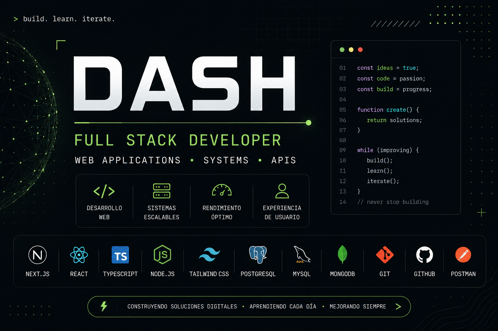

<div align="center">



</div>

---

## 🚀 Lo que hago

<table>
<tr>
<td width="50%">

### 💻 Desarrollo

* Aplicaciones web modernas
* Sistemas de gestión
* APIs y servicios backend
* Soluciones Full Stack

</td>
<td width="50%">

### 🎯 Enfoque

* Escalabilidad
* Rendimiento
* Experiencia de usuario
* Productos digitales

</td>
</tr>
</table>

---

## ⚡ Stack Tecnológico

<div align="center">

### Frontend


### Backend


### Bases de Datos


### Herramientas


</div>

---

## 📌 Actualmente

```txt
🚀 Construyendo proyectos Full Stack
🏗 Diseñando arquitecturas más escalables
🧩 Creando componentes reutilizables
⚙️ Explorando nuevas tecnologías
```

---

## 📊 Estadísticas de GitHub

<div align="center">


</div>

<div align="center">

[](https://git.io/streak-stats)

</div>

---

## ⭐ Proyectos Destacados

| Proyecto            | Descripción                                                      |
| ------------------- | ---------------------------------------------------------------- |
| 🚀 StarLabs Systems | Sistemas web, paneles administrativos y soluciones empresariales |
| 🌐 StarLabs Web     | Landing pages, catálogos y sitios web profesionales              |
| 🧩 Prebuilt         | Componentes, animaciones y recursos reutilizables                |
| 💡 Innovations      | Ideas, experimentos y productos digitales propios                |

---

## 🌎 Conecta Conmigo

<div align="center">

<a href="https://github.com/GeeDash">

</a>

<a href="TU_LINKEDIN">

</a>

<a href="mailto:TU_CORREO">

</a>

</div>

---

<div align="center">

### ⚡ Construir • Aprender • Mejorar

</div>
